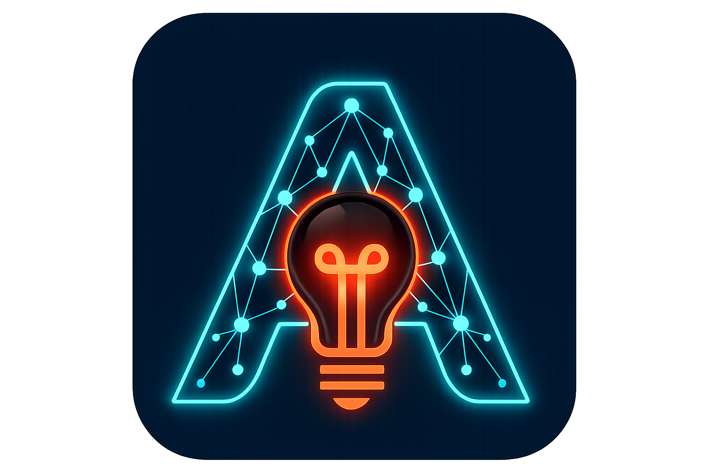
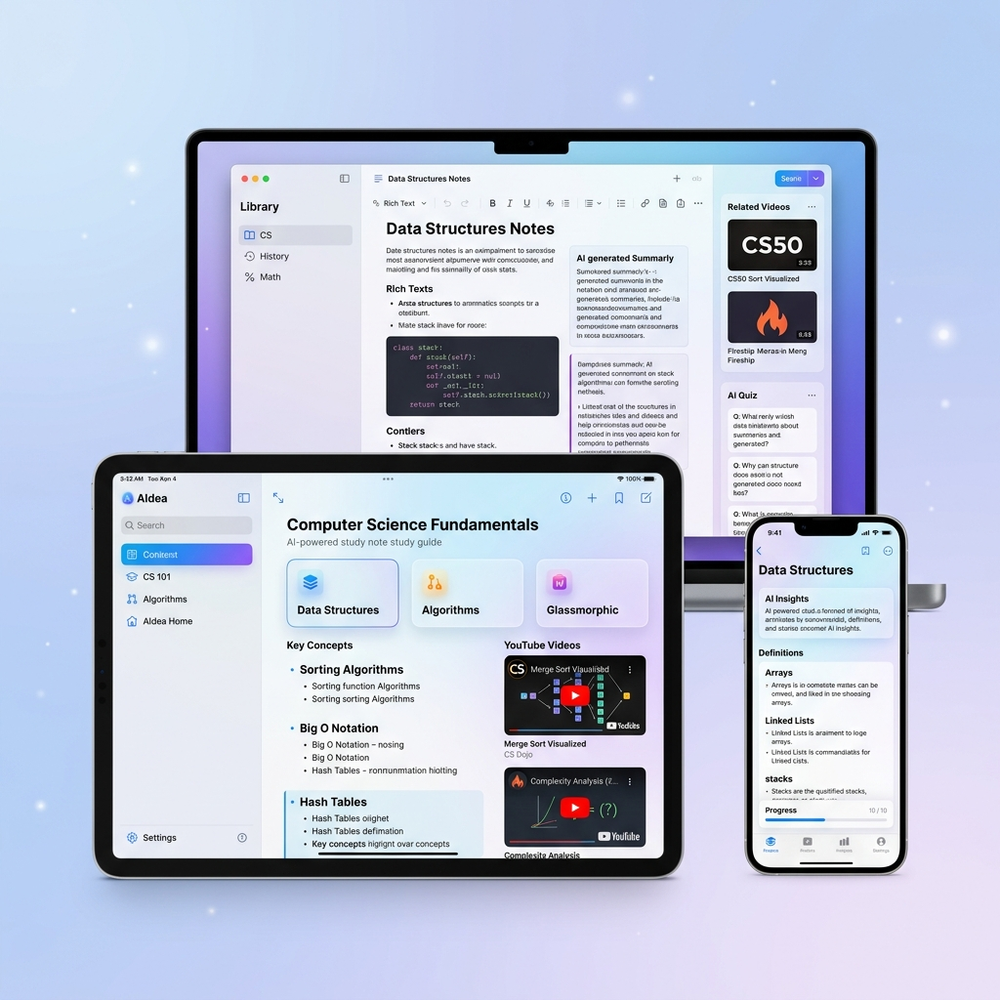

<p align="center">
  
</p>
<h1 align="center">AIdea</h1>

AIdea is a Flutter application that turns YouTube videos into structured study notes with the help of an AI backend. It combines Firebase authentication, Firestore persistence, and a polished cross-platform client to help users generate, save, organize, and revisit learning notes in one place.

This repository contains the Flutter client. A related backend service is available in `AIdea-Server/` and is used for AI note generation and recommendation APIs.

<!--  -->

## Overview

AIdea is built around a simple flow:

1. Users sign in with email/password or Google.
2. Users paste a YouTube video URL.
3. The app sends the request to the AIdea backend.
4. The backend generates notes, key points, and a category.
5. The result is saved to Firestore and becomes searchable, editable, and favoritable inside the app.

## Features

- AI-powered note generation from YouTube videos
- Email/password and Google authentication with Firebase Auth
- Firestore-backed note storage with offline persistence
- Favorite notes and real-time syncing
- Search and category filtering
- Editable note details with share support
- Profile management with photo upload to Firebase Storage
- Analytics dashboard for note activity and categories
- Personalized recommendations view
- Theme and local settings persistence

## Tech Stack

- `Flutter` for the client application
- `Firebase Auth` for authentication
- `Cloud Firestore` for note and user data
- `Firebase Storage` for profile images
- `Provider` for app state
- `HTTP` for backend API communication
- `SharedPreferences` for local settings and lightweight caching

## Project Structure

```text
lib/
|-- main.dart
|-- firebase_options.dart
|-- models/
|   |-- app_user.dart
|   `-- video_note.dart
|-- providers/
|   |-- auth_provider.dart
|   |-- notes_provider.dart
|   `-- settings_provider.dart
|-- services/
|   |-- ai_service.dart
|   |-- auth_service.dart
|   `-- database_service.dart
|-- screens/
|   |-- auth/
|   |-- home/
|   |-- favorites/
|   |-- account/
|   |-- dashboard/
|   |-- recommendations/
|   |-- main_shell.dart
|   `-- splash_screen.dart
|-- theme/
|   `-- app_theme.dart
`-- widgets/
    |-- editorial_quote_card.dart
    `-- note_card.dart
```

## Requirements

- Flutter SDK `3.9.x` or newer
- Dart SDK `3.9.x` or newer
- A Firebase project with Auth, Firestore, and Storage enabled
- An AIdea backend deployment for note generation

## Environment Setup

The app loads its configuration from `aidea.env`.

1. Copy `.env.example` to `aidea.env`
2. Fill in your Firebase and backend values


## Firebase Setup

Configure the following services in your Firebase project:

- `Authentication`
  - Enable Email/Password
  - Enable Google Sign-In
- `Cloud Firestore`
  - Create `users` and `notes` collections
- `Firebase Storage`
  - Used for profile photo uploads

The app also enables Firestore offline persistence at startup.

## Backend Integration

The app expects an AI backend base URL through `AIDEA_BASE_URL`. It uses that backend to:

- `POST /generate` to start note generation
- `GET /status/{task_id}` to poll generation progress

The repository also includes an `AIdea-Server/` directory. That service is the backend companion for note generation and model integration.

## Running the App

Install dependencies:

```bash
flutter pub get
```

Run on Android:

```bash
flutter run
```

Run on Chrome:

```bash
flutter run -d chrome
```


## Supported Platforms

The current Firebase configuration in code targets:

- Android
- Web

Desktop folders exist in the repo, but Firebase options for Windows, macOS, and Linux are not configured by default.

## Data Model

### `users` collection

```json
{
  "id": "user_uid",
  "email": "user@example.com",
  "displayName": "Jane Doe",
  "photoUrl": "https://...",
  "createdAt": "Timestamp",
  "notesCount": 12,
  "gender": "Female",
  "birthDate": "2002-08-14"
}
```

### `notes` collection

```json
{
  "userId": "user_uid",
  "videoUrl": "https://www.youtube.com/watch?v=...",
  "videoTitle": "Sample Video Title",
  "notes": "Generated study notes...",
  "thumbnail": "https://img.youtube.com/vi/.../mqdefault.jpg",
  "category": ["Education", "Technology & AI"],
  "keyPoints": ["Point one", "Point two"],
  "createdAt": "Timestamp",
  "updatedAt": "Timestamp",
  "isFavorite": false
}
```

## Main App Modules

- `AuthProvider` manages sign-in, sign-up, password reset, profile updates, and account deletion.
- `NotesProvider` manages note loading, filtering, favorites, and CRUD operations.
- `AiService` communicates with the AIdea backend and fetches YouTube metadata.
- `DatabaseService` handles Firestore note persistence.
- `SettingsProvider` stores theme and backend preferences locally.